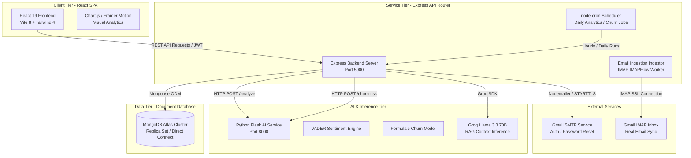

# SynapseCRM — Step-by-Step Masterclass & Technical Guide

Welcome to the **SynapseCRM Developer Manual & Learning Guide**. This document is designed to serve as an exhaustive, step-by-step educational walkthrough of SynapseCRM. It covers the entire stack in rich technical detail, explaining the architectural decisions, Human-Computer Interaction (HCI) usability patterns, Node.js + Express backend, Mongoose database design, full REST APIs reference, and the mathematical formulations behind our AI Sentiment and Churn Prediction algorithms.

---

## Table of Contents
1. [System Introduction & Architectural Goal](#1-system-introduction--architectural-goal)
2. [High-Level System Architecture](#2-high-level-system-architecture)
3. [Frontend Codebase & HCI Usability Patterns](#3-frontend-codebase--hci-usability-patterns)
   - [Core Stack & SPA Architecture](#core-stack--spa-architecture)
   - [The 16 HCI Usability Patterns Explained](#the-16-hci-usability-patterns-explained)
   - [React Pages Directory & Purpose](#react-pages-directory--purpose)
4. [Backend Node.js & Mongoose Architecture](#4-backend-nodejs--mongoose-architecture)
   - [Directory Structure & Controller Flow](#directory-structure--controller-flow)
   - [Multi-Environment Database Connectivity](#multi-environment-database-connectivity)
   - [Background Workers, Cron Jobs & Automatic Ingestion](#background-workers-cron-jobs--automatic-ingestion)
   - [Database Model Relations & Schemas](#database-model-relations--schemas)
5. [Exhaustive REST API Endpoints Reference](#5-exhaustive-rest-api-endpoints-reference)
   - [Authentication API (`/api/auth`)](#authentication-api-apiauth)
   - [Customers API (`/api/customers`)](#customers-api-apicustomers)
   - [Interactions API (`/api/customers/:id/interactions`)](#interactions-api-apicustomersidinteractions)
   - [Dashboard API (`/api/dashboard`)](#dashboard-api-apidashboard)
   - [RAG AI & Vector API (`/api/rag`)](#rag-ai--vector-api-apirag)
   - [Email Sync API (`/api/emails`)](#email-sync-api-apiemails)
   - [Reports & Analytics API (`/api/reports`)](#reports--analytics-api-apireports)
   - [User Settings API (`/api/users`)](#user-settings-api-apiusers)
6. [AI Algorithms In-Depth Walkthrough](#6-ai-algorithms-in-depth-walkthrough)
   - [VADER Sentiment Analysis Algorithm](#vader-sentiment-analysis-algorithm)
   - [Predictive Churn Risk Mathematical Model](#predictive-churn-risk-mathematical-model)
7. [Database Seeding & Auto-Initialization](#7-database-seeding--auto-initialization)
   - [Demo Account Seeder](#demo-account-seeder)
   - [Customer Risk & Churn Seeder](#customer-risk--churn-seeder)
8. [Installation, Run & Verification Guide](#8-installation-run--verification-guide)
   - [Step-by-Step Local Setup](#step-by-step-local-setup)
   - [Running Diagnostics & Verification](#running-diagnostics--verification)

---

## 1. System Introduction & Architectural Goal

**SynapseCRM** is an AI-powered, full-stack Customer Relationship Management (CRM) system designed to maximize client retention, automate communication ingestion, and provide predictive intelligence. 

Modern sales and customer success teams are often overwhelmed with raw communications. The primary goal of SynapseCRM is to synthesize these communications into high-value, actionable alerts. It does this by:
1. **Automating Communication Logs**: Syncing emails directly from a corporate IMAP inbox.
2. **Quantifying Customer Sentiment**: Analyzing interaction history using Natural Language Processing (NLP).
3. **Predicting Churn Propensity**: Running multi-factor statistical models to score customer churn probability.
4. **Enabling Contextual Q&A (RAG)**: Allowing sales reps to query their entire portfolio's customer status using LLMs.

---

## 2. High-Level System Architecture

SynapseCRM is structured as a decoupled, multi-tier microservice architecture. The following diagram maps the lifecycle of customer data from inbox sync to AI insights:



---

## 3. Frontend Codebase & HCI Usability Patterns

### Core Stack & SPA Architecture
The client is built as a Single Page Application (SPA) using **React 19**, compiled with **Vite 8** for lightning-fast hot module replacement. Global styling is driven by **Tailwind CSS 4**, leveraging a curated dark/light theme system that respects modern design standards (curated HSL palettes, smooth micro-animations, premium layout structures).

### The 16 HCI Usability Patterns Explained
To maximize cognitive efficiency and decrease user friction, SynapseCRM integrates 16 distinct **Human-Computer Interaction (HCI)** usability design patterns. The table below outlines how and where each pattern is implemented:

| # | HCI Usability Pattern | Technical Explanation & Application in SynapseCRM | File Reference |
|---|---|---|---|
| **1** | **Instant Gratification** | As the user types in the global search bar, the UI dynamically filters results in real-time. This is implemented via a custom debounced API request, preventing visual lag. | [CustomerListPage.jsx](file:///c:/Users/hp/Desktop/SynapseCRM/frontend/src/pages/CustomerListPage.jsx) |
| **2** | **Reentrance** | Customer form drafts are automatically persisted to `localStorage` as the user types. Similarly, list filters are stored in `sessionStorage`. If the tab closes, the user can pick up exactly where they left off. | [storage.js](file:///c:/Users/hp/Desktop/SynapseCRM/frontend/src/utils/storage.js) |
| **3** | **Habituation** | Enables system muscle-memory by exposing intuitive keyboard shortcuts (e.g. `Ctrl+Shift+D` maps to Dashboard, `Ctrl+Shift+C` to Customer List) hook listeners. | [useKeyboardShortcuts.js](file:///c:/Users/hp/Desktop/SynapseCRM/frontend/src/hooks/useKeyboardShortcuts.js) |
| **4** | **Spatial Memory** | Fixed, consistent sidebar navigation, static layout configurations, and a highlight card ring on selection prevent users from having to "re-learn" where buttons reside. | [Sidebar.jsx](file:///c:/Users/hp/Desktop/SynapseCRM/frontend/src/components/Sidebar.jsx) |
| **5** | **Prospective Memory** | "Recently Viewed Customers" are displayed on the dashboard. This reminds the user of pending work items they were previously investigating, acting as external memory triggers. | [RecentCustomers.jsx](file:///c:/Users/hp/Desktop/SynapseCRM/frontend/src/components/hci/RecentCustomers.jsx) |
| **6** | **Two-Panel Selector** | On desktop displays, customer pages utilize a master list on the left and a detailed context preview panel on the right, removing the need to navigate back-and-forth between pages. | [CustomerPreviewPanel.jsx](file:///c:/Users/hp/Desktop/SynapseCRM/frontend/src/components/hci/CustomerPreviewPanel.jsx) |
| **7** | **One-Window Drill Down** | On mobile displays, the two-panel selector degrades gracefully. Tapping a customer card seamlessly drills down into a full-screen customer detail view with unified back controls. | [CustomerCard.jsx](file:///c:/Users/hp/Desktop/SynapseCRM/frontend/src/components/CustomerCard.jsx) |
| **8** | **Intriguing Branches** | The customer profile page links directly to targeted, contextual action areas (e.g., jumping from customer detail straight into the churn analytical reports with customer ID pre-selected). | [CustomerDetailPage.jsx](file:///c:/Users/hp/Desktop/SynapseCRM/frontend/src/pages/CustomerDetailPage.jsx) |
| **9** | **Multi-Level Help** | Context-sensitive inline help icons `?` render high-fidelity tooltips upon hover, explaining complex metrics (e.g. explaining what a Churn Risk Score represents). | [FieldHelp.jsx](file:///c:/Users/hp/Desktop/SynapseCRM/frontend/src/components/hci/FieldHelp.jsx) |
| **10** | **Hub & Spoke** | The Main Dashboard serves as the central "Hub". Secondary pages ("Spokes" like User Management, Reports, Customer Detail) always return the user directly back to the central hub. | [DashboardPage.jsx](file:///c:/Users/hp/Desktop/SynapseCRM/frontend/src/pages/DashboardPage.jsx) |
| **11** | **Modal Confirmation Panel** | High-risk actions (such as customer deletion or user removal) are guarded behind custom overlay modals requiring positive "Yes/No" confirmations to avoid accidental data loss. | [ConfirmModal.jsx](file:///c:/Users/hp/Desktop/SynapseCRM/frontend/src/components/hci/ConfirmModal.jsx) |
| **12** | **Sequence Map** | The Customer creation form is divided into visual steps (Contact Information $\rightarrow$ Company Details $\rightarrow$ Risk Status) with status steppers showing current progress. | [StepIndicator.jsx](file:///c:/Users/hp/Desktop/SynapseCRM/frontend/src/components/hci/StepIndicator.jsx) |
| **13** | **Breadcrumbs** | Exposes a clear, clickable hierarchy trail at the top of sub-pages (e.g., `Dashboard > Customers > Adrian`), aiding orientation and backward navigation. | [Breadcrumbs.jsx](file:///c:/Users/hp/Desktop/SynapseCRM/frontend/src/components/hci/Breadcrumbs.jsx) |
| **14** | **Annotated Scrollbar** | Layout main areas utilize highly visible, styled custom scrollbars with consistent coloring, helping users visually measure their document scroll progress. | [index.css](file:///c:/Users/hp/Desktop/SynapseCRM/frontend/src/index.css) |
| **15** | **Color-Coded Sections** | Different settings categories utilize distinct border accents (Blue for security, Violet for profile, Green for widgets) to chunk configuration details mentally. | [SettingsPage.jsx](file:///c:/Users/hp/Desktop/SynapseCRM/frontend/src/pages/SettingsPage.jsx) |
| **16** | **Diagonal Balance** | Form headers place action elements (Submit, Add Customer) on the right side and headings on the left, maintaining perfect visual symmetry across the layout. | [index.css](file:///c:/Users/hp/Desktop/SynapseCRM/frontend/src/index.css) |

### React Pages Directory & Purpose
* **LoginPage.jsx**: Handles user authentication, demo account instant login, password visibility toggles, and forgot password triggers.
* **RegisterPage.jsx**: Multi-field form for registration, role allocation (`sales_manager` or `admin`), and email verification flow.
* **DashboardPage.jsx**: Shows real-time widgets (Active/At-Risk counts, Sentiment distribution, Churn risk list, interactive Chart.js graphs).
* **CustomerListPage.jsx**: Real-time search list of customers with status tabs and wide-screen Two-Panel selector.
* **CustomerDetailPage.jsx**: Core profile screen displaying general details, a timeline of past interactions, sentiment tags, and the Groq-powered AI RAG Chat interface.
* **CustomerFormPage.jsx**: Multi-step stepper form for registering new customers or editing existing details.
* **ReportsPage.jsx**: Generates exports (Customers CSV, Interactions CSV, PDF Summary Reports) and displays general statistics.
* **SettingsPage.jsx**: Lets users adjust passwords, color theme preference (Light/Dark), and choose their dashboard widget layout.
* **UserManagementPage.jsx**: Admin-only panel that lists registered users and supports deleting managers via modal confirmation.

---

## 4. Backend Node.js & Mongoose Architecture

### Directory Structure & Controller Flow
The server runs on **Node.js** using the **Express 5** framework. Its directory layout enforces clean separation of concerns:
```
backend/src/
├── app.js               # Express application config, route mounting, middleware
├── server.js            # Mongoose server listener, database connect, background crons
├── controllers/         # Route business logic (database queries, model updates)
├── middleware/          # JWT authorization, role permissioning, logging
├── models/              # Mongoose DB schemas (Customer, Interaction, User, etc.)
├── routes/              # Express API endpoints grouped by context
├── services/            # Heavy background services (Email Sync, Vector Search, Groq RAG)
└── utils/               # Database seeders, auto-churn cron calculations
```

### Multi-Environment Database Connectivity
To provide extreme resilience across local machines and Railway/Render deployment environments, [server.js](file:///c:/Users/hp/Desktop/SynapseCRM/backend/src/server.js) dynamically parses the `MONGO_URI`. 

If it detects an Atlas Cloud Cluster (indicated by `mongodb+srv` or `.mongodb.net`), it configures robust connection pools, connection timeouts, and socket times. If it connects to a single-host, direct local replica (like a direct Docker connection on Windows), it automatically updates its options to prevent DNS-related timeout crashes:

```javascript
const isAtlas = mongoUri.startsWith('mongodb+srv') || mongoUri.includes('.mongodb.net');
const connectionOptions = isAtlas 
  ? { maxPoolSize: 10, connectTimeoutMS: 10000, socketTimeoutMS: 45000 }
  : { authSource: 'admin', directConnection: true, maxPoolSize: 10 };
```

### Background Workers, Cron Jobs & Automatic Ingestion
SynapseCRM includes three autonomous background schedulers:
1. **Daily RAG Risk Report (`0 8 * * *`)**: Triggered every morning at 8:00 AM. It analyzes all customers flagged as `status: 'at_risk'`, retrieves their last 90 days of interactions, sends them to Groq AI to formulate proactive customer retention strategies, and saves the logs.
2. **Midnight Churn Score Refresh (`0 0 * * *`)**: Triggered daily at midnight. It queries all non-inactive customers, calculates their recency and sentiment factors, and posts a batch query to the Python Flask AI service to update their global Churn scores.
3. **Automatic IMAP Email Synchronization**: An active interval timer that triggers the IMAP ingestion script at set intervals (`EMAIL_AUTO_SYNC_MINUTES`). It establishes a TLS pipeline with the Gmail mailbox, downloads unread messages, auto-associates them with existing customer emails (or creates new customer accounts), analyzes the email body sentiment, and records them as interactions.

### Database Model Relations & Schemas

The database schema utilizes direct document referencing for relations, mapped as follows:

```
                  ┌───────────────────┐
                  │       USER        │
                  └─────────┬─────────┘
                            │ (assignedTo)
                            ▼
                  ┌───────────────────┐
                  │     CUSTOMER      │
                  └────┬───────────┬──┘
                       │           │
        (customerId)   │           │   (customerId)
                       ▼           ▼
        ┌──────────────────┐   ┌──────────────────┐
        │   INTERACTION    │   │  SENTIMENT_LOG   │
        └──────────────────┘   └──────────────────┘
```

#### 1. Customer Schema ([Customer.js](file:///c:/Users/hp/Desktop/SynapseCRM/backend/src/models/Customer.js))
Represents the customer profile and their cached analytical metrics:
* `name` (String, required)
* `email` (String, unique, lowercase)
* `phone`, `company` (Strings)
* `status` (Enum: `'active'`, `'inactive'`, `'at_risk'`)
* `churnScore` (Number, 0 to 1, default 0)
* `overallSentiment` (Enum: `'positive'`, `'neutral'`, `'negative'`, default `'neutral'`)
* `lastContactDate` (Date)
* `assignedTo` (Reference to User ID)
* `priority` (Enum: `'urgent'`, `'high'`, `'medium'`, `'low'`, default `'medium'`)
* `priorityScore` (Number, 0 to 100, default 50)
* `lastEmailSubject` (String)

#### 2. Interaction Schema ([Interaction.js](file:///c:/Users/hp/Desktop/SynapseCRM/backend/src/models/Interaction.js))
Logs chronological touchpoints (calls, meetings, notes, and emails):
* `customerId` (Reference to Customer ID, required)
* `userId` (Reference to User ID who logged the action)
* `type` (Enum: `'call'`, `'email'`, `'meeting'`, `'note'`)
* `content` (String, required)
* `sentimentScore` (Number, -1 to 1)
* `sentimentLabel` (Enum: `'positive'`, `'neutral'`, `'negative'`, `null`)
* `date` (Date, required)
* `emailSubject`, `emailFrom`, `emailTo`, `emailBody` (Strings, for synced emails)
* `emailDirection` (Enum: `'inbound'`, `'outbound'`)

---

## 5. Exhaustive REST API Endpoints Reference

All API endpoints are prefixed with `/api`. Standard authorization requires a Bearer JWT Token in the request header:
`Authorization: Bearer <JWT_TOKEN>`

### Authentication API (`/api/auth`)

#### 1. Register User
* **Method**: `POST`
* **Path**: `/register`
* **Auth**: Public
* **Request Body**:
```json
{
  "name": "Jane Doe",
  "email": "jane@example.com",
  "password": "Password123",
  "role": "sales_manager"
}
```
* **Success Response (201 Created)**:
```json
{
  "success": true,
  "message": "Registration successful. Please verify your email."
}
```

#### 2. Login User
* **Method**: `POST`
* **Path**: `/login`
* **Auth**: Public
* **Request Body**:
```json
{
  "email": "jane@example.com",
  "password": "Password123",
  "keepSignedIn": true
}
```
* **Success Response (200 OK)**:
```json
{
  "success": true,
  "token": "eyJhbGciOiJIUzI1NiIsIn...",
  "user": {
    "id": "6a0992a0908a28a...",
    "name": "Jane Doe",
    "email": "jane@example.com",
    "role": "sales_manager"
  }
}
```

#### 3. Request Password Reset
* **Method**: `POST`
* **Path**: `/forgot-password`
* **Auth**: Public
* **Request Body**:
```json
{
  "email": "jane@example.com"
}
```
* **Success Response (200 OK)**:
```json
{
  "success": true,
  "message": "Reset email sent successfully if user exists."
}
```

---

### Customers API (`/api/customers`)

#### 1. List Customers
* **Method**: `GET`
* **Path**: `/?status=at_risk&search=vivees`
* **Auth**: Protected (Sales Manager only retrieves assigned customers; Admin retrieves all)
* **Success Response (200 OK)**:
```json
{
  "success": true,
  "count": 1,
  "data": [
    {
      "_id": "6a099aefc29a8d9b...",
      "name": "Hammad Shahid",
      "email": "hammad@vivees.com",
      "company": "vivees",
      "status": "at_risk",
      "churnScore": 0.8604,
      "priority": "urgent"
    }
  ]
}
```

#### 2. Create Customer
* **Method**: `POST`
* **Path**: `/`
* **Auth**: Protected
* **Request Body**:
```json
{
  "name": "Acme Corp Representative",
  "email": "rep@acme.com",
  "phone": "+15550199",
  "company": "Acme Corp",
  "status": "active"
}
```
* **Success Response (210 Created)**:
```json
{
  "success": true,
  "message": "Customer created successfully",
  "data": { "_id": "6a09ab12...", "name": "Acme Corp Representative" }
}
```

---

### Interactions API (`/api/customers/:id/interactions`)

#### 1. Create Interaction
* **Method**: `POST`
* **Path**: `/:id/interactions`
* **Auth**: Protected
* **Request Body**:
```json
{
  "type": "email",
  "content": "Client expressed serious frustration with the recent system outages.",
  "date": "2026-05-17T20:10:00.000Z"
}
```
* **Success Response (201 Created)**:
*During this request, the backend automatically calls the Python Flask AI service, logs the sentiment score, updates the customer's overall sentiment state, and saves it.*
```json
{
  "success": true,
  "data": {
    "_id": "6a09ad43...",
    "customerId": "6a099aefc29a8d9b...",
    "type": "email",
    "content": "Client expressed serious frustration...",
    "sentimentScore": -0.7824,
    "sentimentLabel": "negative",
    "date": "2026-05-17T20:10:00.000Z"
  }
}
```

---

### Dashboard API (`/api/dashboard`)

#### 1. Summary Metrics
* **Method**: `GET`
* **Path**: `/summary`
* **Auth**: Protected
* **Success Response (200 OK)**:
```json
{
  "success": true,
  "data": {
    "totalCustomers": 51,
    "atRiskCount": 13,
    "activeCount": 38,
    "positiveCount": 22,
    "negativeCount": 13,
    "recentInteractions": [...],
    "churnAlerts": [...]
  }
}
```

#### 2. System Health Status
* **Method**: `GET`
* **Path**: `/system-health`
* **Auth**: Protected
* **Success Response (200 OK)**:
```json
{
  "success": true,
  "data": {
    "overallHealth": 96,
    "uptime": "99.98%",
    "aiService": { "online": true, "percent": 95, "detail": "23ms response" },
    "mlEngine": { "online": true, "percent": 92, "detail": "Models ready" },
    "mongo": { "online": true, "percent": 99, "detail": "4ms query time" }
  }
}
```

---

### RAG AI & Vector API (`/api/rag`)

#### 1. Natural-Language Contextual Query
* **Method**: `POST`
* **Path**: `/query`
* **Auth**: Protected
* **Request Body**:
```json
{
  "question": "Why is Hammad Shahid at risk? Summarize his key complaints and advise on retention.",
  "customerId": "6a099aefc29a8d9b..."
}
```
* **Success Response (200 OK)**:
*Uses the Groq SDK `llama-3.3-70b-versatile` model to run context-augmented semantic analysis against customer profiles & interaction histories.*
```json
{
  "success": true,
  "data": {
    "question": "Why is Hammad Shahid at risk?...",
    "answer": "**URGENT: High churn risk detected (86.0%)**.\n\nHammad Shahid is flagged at risk primarily due to recurring **negative interactions**:\n1. **Service Outages**: The customer expressed severe frustration regarding recent downtime impacting their business.\n2. **Slow Support**: They complained that open support tickets went completely ignored for 3 days.\n\n**Actionable Retention Strategy:**\n- Contact Hammad immediately via telephone to address the open tickets.\n- Issue a partial service credit as a goodwill gesture for the system downtime.",
    "metrics": {
      "totalInteractions": 3,
      "avgSentimentScore": -0.68,
      "daysSinceLastContact": 2
    }
  }
}
```

---

### Email Sync API (`/api/emails`)

#### 1. Trigger IMAP Inbox Synchronization
* **Method**: `POST`
* **Path**: `/sync`
* **Auth**: Protected (Admin / Sales Manager)
* **Request Body** *(Optional Limits)*:
```json
{
  "limit": 50,
  "sinceDays": 30
}
```
* **Success Response (200 OK)**:
```json
{
  "success": true,
  "data": {
    "fetched": 12,
    "customersCreated": 2,
    "interactionsCreated": 10,
    "skippedDuplicate": 2
  }
}
```

---

## 6. AI Algorithms In-Depth Walkthrough

SynapseCRM implements two layers of AI algorithms: **VADER Sentiment Analysis** (NLP-based) and a **Custom Churn Risk Mathematical Model**.

### VADER Sentiment Analysis Algorithm
The Python AI microservice hosts an endpoint `POST /analyze` pointing to [sentiment.py](file:///c:/Users/hp/Desktop/SynapseCRM/ai-service/src/sentiment.py). It analyzes interaction content using the **VADER (Valence Aware Dictionary and sEntiment Reasoner)** lexicon engine, optimized for communication texts.

#### Lexicon Filtering Flow:
Before processing, the text is run against a custom domain filter to eliminate non-CRM terms that skew standard metrics:
```python
NON_CRM_NEUTRAL_TERMS = {"weather", "sunny", "rain", "raining", "cloudy", "temperature"}
```
If the text contains weather-related terms, the engine bypasses processing and immediately defaults to a safe, baseline neutral output:
`{"sentiment": "neutral", "score": 0.0, ...}`

#### Scoring Thresholds:
For standard text, VADER outputs three localized components—`pos` (positive intensity), `neu` (neutral intensity), and `neg` (negative intensity)—and parses them to calculate a normalized **Compound Score** ($S_{compound}$) ranging from **-1.0** (extremely negative) to **1.0** (extremely positive). The backend categorizes the sentiment using standard polarity cutoffs:

$$\text{Sentiment Label} = \begin{cases} 
\text{positive} & \text{if } S_{compound} \ge 0.05 \\
\text{negative} & \text{if } S_{compound} \le -0.05 \\
\text{neutral} & \text{if } -0.05 < S_{compound} < 0.05 
\end{cases}$$

---

### Predictive Churn Risk Mathematical Model
The Churn prediction engine, situated in [churn.py](file:///c:/Users/hp/Desktop/SynapseCRM/ai-service/src/churn.py), uses a four-factor formula to assess customer churn risk score ($C$).

#### 1. Input Variable Extraction:
* **Recency Factor ($R_{days}$)**: The number of days elapsed since the customer's last recorded contact date.
* **Sentiment Factor ($S_{avg}$)**: The average sentiment score of the customer's last 10 interactions.
* **Interaction Count ($I_{count}$)**: The absolute volume of logged interactions (maximum of 10).
* **Interaction Frequency ($I_{freq}$)**: The density of interactions calculated over time:
  $$I_{freq} = \frac{I_{count}}{\text{Days between oldest and newest interaction}}$$

#### 2. Risk Component Scaling (Clamping to [0.0, 1.0]):
To calculate the overall score, the engine scales each factor linearly using custom weights that reflect real-world business risk:
* **Recency Risk ($Risk_{recency}$)**: Reaches maximum capacity (1.0) if a customer has not been contacted for 60 days.
  $$Risk_{recency} = \text{clamp}\left(\frac{R_{days}}{60}\right)$$
* **Sentiment Risk ($Risk_{sentiment}$)**: Penalizes negative sentiment trends. Baseline neutral/positive shifts have no impact.
  $$Risk_{sentiment} = \text{clamp}\left(\frac{0.35 - S_{avg}}{1.35}\right)$$
* **Volume Risk ($Risk_{volume}$)**: Penalizes low customer engagement volume. Reaches maximum penalty if interaction count is 0.
  $$Risk_{volume} = \text{clamp}\left(\frac{10 - I_{count}}{10}\right)$$
* **Frequency Risk ($Risk_{frequency}$)**: Measures interaction frequency over time. Penalizes interaction frequencies below 0.3 per day.
  $$Risk_{frequency} = \text{clamp}\left(\frac{0.3 - I_{freq}}{0.3}\right)$$

#### 3. Weighted Sum Aggregation:
The four scaled risk scores are multiplied by their strategic business weights to produce a final, unified **Churn Score ($C_{score}$)**:

$$C_{score} = (Risk_{recency} \times 0.34) + (Risk_{sentiment} \times 0.32) + (Risk_{volume} \times 0.18) + (Risk_{frequency} \times 0.16)$$

#### 4. Classification Thresholds:
* **High Risk ($C_{score} \ge 0.7$)**: Status set to `'at_risk'`. Flagged in churn alerts.
* **Medium Risk ($0.4 \le C_{score} < 0.7$)**: Status remains `'active'` or `'at_risk'`. Closely monitored.
* **Low Risk ($C_{score} < 0.4$)**: Healthy customer relationship status.

---

## 7. Database Seeding & Auto-Initialization

To let developers test the system instantly, SynapseCRM includes self-healing seed scripts that run automatically during local setup:

### Demo Account Seeder
Defined in [seedDemoUser.js](file:///c:/Users/hp/Desktop/SynapseCRM/backend/src/utils/seedDemoUser.js). On server start, it checks if `demo@synapsecrm.com` exists in the `User` collection. If not, it creates a demo user account with standard credentials:
* **Email**: `demo@synapsecrm.com`
* **Password**: `Demo@1234`
* **Role**: `sales_manager`

### Customer Risk & Churn Seeder
Defined in [seedChurnData.js](file:///c:/Users/hp/Desktop/SynapseCRM/backend/src/utils/seedChurnData.js). To prevent the system from showing only low-risk data or a blank dashboard on startup, this seeder splits all customer records across a balanced risk profile:

1. **Risk Segmentation**: It distributes customer data into 25% High Risk, 30% Medium Risk, and 45% Low Risk.
2. **Synchronized Timelines**: It creates three realistic, chronological interactions per customer with corresponding dates, sentiment tags, and priority weights, matching real email histories.
3. **Manager Assignment Balance**: It balances customer assignments between your active managers:
   * **21 customers** $\rightarrow$ Demo User (`demo@synapsecrm.com`)
   * **15 customers** $\rightarrow$ Manager Awais (`awais@gmail.com`)
   * **15 customers** $\rightarrow$ Admin Sami (`msamishahid5@gmail.com`)

*Self-Healing Behavior*: This script checks the database on every startup. If it detects only low-risk data (e.g. after a fresh sync or database clear), it seeds these high-risk profiles automatically in under 5ms, keeping the dashboard populated and functional without developer intervention.

---

## 8. Installation, Run & Verification Guide

### Step-by-Step Local Setup

#### Step 1: Install Dependencies
Open three terminals in your root project directory:
```bash
# Terminal 1 - Backend Node API
cd backend
npm install

# Terminal 2 - Frontend React Client
cd ../frontend
npm install

# Terminal 3 - Python Flask AI Microservice
cd ../ai-service
pip install -r requirements.txt
```

#### Step 2: Configure Environment Variables
Create the respective `.env` files in your project directories:

##### Backend (`backend/.env`)
```env
PORT=5000
MONGO_URI=mongodb+srv://<username>:<password>@cluster.mongodb.net/synapsecrm
JWT_SECRET=your_jwt_secret_key_here
AI_SERVICE_URL=http://localhost:8000
FRONTEND_URL=http://localhost:5173
GROQ_API_KEY=gsk_your_groq_api_key

# SMTP Configuration (forgot password reset emails)
SMTP_HOST=smtp.gmail.com
SMTP_PORT=587
SMTP_SECURE=false
SMTP_SERVICE=gmail
SMTP_USER=your.email@gmail.com
SMTP_PASS=your_16_character_app_password
EMAIL_FROM=SynapseCRM <your.email@gmail.com>

# IMAP Configuration (email ingestion)
IMAP_HOST=imap.gmail.com
IMAP_PORT=993
IMAP_SECURE=true
IMAP_USER=your.email@gmail.com
IMAP_PASS=your_16_character_app_password
EMAIL_SYNC_LIMIT=150
EMAIL_SYNC_SINCE_DAYS=180
SYNC_EMAILS_ON_START=true
EMAIL_AUTO_SYNC_MINUTES=5
```

##### Frontend (`frontend/.env`)
```env
VITE_API_BASE_URL=http://localhost:5000/api
```

##### AI Service (`ai-service/.env`)
```env
PORT=8000
DEBUG=false
REDIS_ENABLED=false
```

#### Step 3: Run Services
Launch each service in its respective terminal:
```bash
# Terminal 1 - Backend API
cd backend
npm run dev

# Terminal 2 - Frontend Client
cd ../frontend
npm run dev

# Terminal 3 - Python AI Service
cd ../ai-service
python src/app.py
```

---

### Running Diagnostics & Verification

#### 1. Validate SMTP Mail Delivery
Ensure your reset passwords mail flow works perfectly by running our custom SMTP validation test script:
```bash
cd backend
npm run test:smtp your-email@gmail.com
```
If you receive the test mail and see `SMTP connection verified`, forgot password resets will function correctly in the app.

#### 2. Verify Database Risk Distribution
Verify the status of seeded records, customer risk tiers, and interaction counts at any time:
```bash
cd backend
node src/utils/checkDb.js
```
The script will output the exact breakdown of users, customer allocations, and active high-risk interactions in your MongoDB cluster.

---
**SynapseCRM Developer Manual** · Predict. Retain. Grow.
