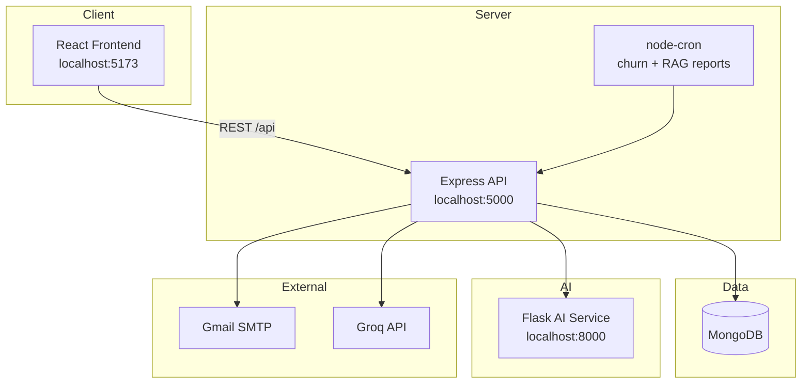

# SynapseCRM

A full-stack, AI-powered Customer Relationship Management (CRM) system. SynapseCRM helps sales and admin teams manage customers, log interactions, track sentiment and churn risk, and get AI-driven insights through a modern React web app backed by Node.js and MongoDB.

---

## Table of contents

- [Features](#features)
- [Tech stack](#tech-stack)
- [Architecture](#architecture)
- [Project structure](#project-structure)
- [Getting started](#getting-started)
- [Environment variables](#environment-variables)
- [Application routes](#application-routes)
- [API overview](#api-overview)
- [User roles](#user-roles)
- [HCI & UX patterns](#hci--ux-patterns)
- [Additional documentation](#additional-documentation)
- [Scripts reference](#scripts-reference)

---

## Features

### Authentication & security
- User registration with **email verification** (Gmail SMTP)
- Login with **“Keep me signed in”** (long-lived token) or session-only token
- **Forgot password** and reset via email link
- JWT-protected API routes
- **Demo account** auto-seeded on backend startup (“Try Demo Account” on login)
- Password visibility toggle on login and register pages

### Customer management
- Create, read, update, and delete customers
- Customer status: `active`, `at_risk`, `inactive`
- Live search with debounced filtering
- Two-panel layout on large screens (list + preview)
- Multi-step customer form (Contact → Company & status)
- Recently viewed customers on dashboard

### Interactions & sentiment
- Log calls, emails, meetings, and notes per customer
- Sentiment analysis via Python AI microservice (VADER)
- Sentiment history and badges on customer detail

### AI & churn intelligence
- Churn risk scoring (Python microservice + scheduled refresh)
- RAG-powered customer Q&A chat (`/api/rag`)
- Daily at-risk customer insights (cron job)
- Dashboard KPIs: sentiment trends, churn distribution, admin overview

### Email inbox import
- Fetch **real emails** from Gmail inbox via IMAP (same app password as SMTP)
- Auto-create **customers** from sender addresses
- Log each message as an **email interaction** with subject + body
- Optional sentiment analysis on imported content
- CLI: `npm run sync:emails` · API: `POST /api/emails/sync` (admin/sales manager)

### Reports & exports
- CSV export for customers and interactions
- PDF-style customer reports
- Summary analytics on reports page

### Admin
- **User management** (admin only): list users, delete with Yes/No confirmation modal
- Role-based access: `admin`, `sales_manager`
- Theme preferences (light/dark) per user

### UX (HCI patterns)
- Breadcrumbs, confirm modals, keyboard shortcuts, field help tooltips, step indicators, and more — see [HCI & UX patterns](#hci--ux-patterns)

---

## Tech stack

| Layer | Technology |
|-------|------------|
| **Frontend** | React 19, Vite 8, React Router 6, Tailwind CSS 4, Axios, Chart.js, Framer Motion, Lucide / Heroicons |
| **Backend** | Node.js, Express 5, Mongoose, JWT, bcrypt, Nodemailer, node-cron, Groq SDK |
| **Database** | MongoDB (Atlas or local) |
| **AI service** | Python 3, Flask, VADER sentiment, custom churn model |
| **Email** | Gmail SMTP (verification + password reset) |
| **Deploy** | Frontend: Vercel · Backend: Railway/Render-compatible |

---

## Architecture



**Request flow (example — log interaction):**
1. User submits interaction in the React app.
2. Backend saves to MongoDB and forwards text to the AI service for sentiment.
3. Sentiment score updates customer churn/risk fields.
4. Dashboard and customer detail reflect new data.

---

## Project structure

```
SynapseCRM/
├── frontend/                 # React SPA (Vite)
│   ├── public/
│   ├── src/
│   │   ├── api/              # Axios API clients (auth, customers, users, …)
│   │   ├── assets/           # Logo, static images
│   │   ├── components/       # Reusable UI
│   │   │   ├── hci/          # HCI pattern components (modals, breadcrumbs, …)
│   │   │   ├── admin/        # Admin-specific panels
│   │   │   └── rag/          # RAG chat UI
│   │   ├── context/          # AuthContext (global auth state)
│   │   ├── hooks/            # useAuth, useCustomers, useTheme, shortcuts
│   │   ├── pages/            # Route-level screens
│   │   ├── utils/            # storage, formatters
│   │   ├── App.jsx           # Routes & lazy-loaded pages
│   │   ├── main.jsx          # Entry + providers
│   │   └── index.css         # Tailwind + design tokens
│   ├── vite.config.js        # Dev proxy → backend :5000
│   └── package.json
│
├── backend/                  # Node.js REST API
│   ├── src/
│   │   ├── controllers/      # Route handlers (auth, customers, dashboard, …)
│   │   ├── middleware/         # JWT auth, role authorize, performance
│   │   ├── models/           # Mongoose schemas (User, Customer, Interaction, …)
│   │   ├── routes/             # Express routers mounted in app.js
│   │   ├── services/           # email, RAG batch, vector search
│   │   ├── utils/              # churn refresh, demo user seed
│   │   ├── __tests__/          # Jest API tests
│   │   ├── app.js              # Express app + middleware + routes
│   │   └── server.js           # DB connect, cron, listen
│   ├── .env.example
│   └── package.json
│
├── ai-service/               # Python Flask microservice
│   ├── src/
│   │   ├── app.py            # /health, /analyze, /churn-risk
│   │   ├── sentiment.py      # VADER sentiment
│   │   └── churn.py          # Churn risk calculation
│   └── .env.example
│
├── docs/
│   └── IMPROVEMENTS-AND-SETUP.md   # SMTP setup, HCI mapping, backlog
│
└── README.md                 # This file
```

### Frontend (`frontend/src`)

| Folder / file | Purpose |
|---------------|---------|
| `pages/LoginPage.jsx` | Sign in, demo login, forgot password link |
| `pages/RegisterPage.jsx` | Account creation + email verification flow |
| `pages/VerifyEmailPage.jsx` | Email verification link handler |
| `pages/CheckEmailPage.jsx` | Post-register “check your inbox” |
| `pages/DashboardPage.jsx` | KPI hub, widgets, recent customers |
| `pages/CustomerListPage.jsx` | Search, filters, two-panel preview |
| `pages/CustomerDetailPage.jsx` | Profile, interactions, sentiment, RAG |
| `pages/CustomerFormPage.jsx` | Add/edit customer (stepped form) |
| `pages/ReportsPage.jsx` | Exports and report summaries |
| `pages/UserManagementPage.jsx` | Admin user list & delete (confirm modal) |
| `pages/SettingsPage.jsx` | Theme, password, preferences |
| `components/Layout.jsx` | Sidebar, navbar, keyboard shortcuts |
| `components/hci/ConfirmModal.jsx` | Yes/No delete confirmations |
| `context/AuthContext.jsx` | Login state, token storage |
| `api/axiosInstance.js` | Base URL, JWT interceptor |

### Backend (`backend/src`)

| Folder / file | Purpose |
|---------------|---------|
| `routes/authRoutes.js` | Register, login, verify email, reset password |
| `routes/customerRoutes.js` | CRUD + search |
| `routes/interactionRoutes.js` | Nested under `/customers/:id/interactions` |
| `routes/dashboardRoutes.js` | Summary, trends, churn charts |
| `routes/ragRoutes.js` | AI query, summarize, churn refresh |
| `routes/userRoutes.js` | User list (admin), preferences |
| `routes/reportRoutes.js` | CSV/PDF exports |
| `models/User.js` | Auth, roles, verification tokens |
| `models/Customer.js` | Customer records + churn fields |
| `models/Interaction.js` | Activity log per customer |
| `services/emailService.js` | Verification & reset emails |
| `utils/seedDemoUser.js` | Creates demo account on startup |

### AI service (`ai-service/src`)

| File | Endpoints |
|------|-----------|
| `app.py` | `GET /health`, `POST /analyze`, `POST /churn-risk` |
| `sentiment.py` | VADER-based sentiment scoring |
| `churn.py` | Rule/model-based churn risk |

---

## Getting started

### Prerequisites

- **Node.js** 18+ and npm
- **MongoDB** connection string (Atlas recommended)
- **Python** 3.9+ (for AI service, optional but needed for sentiment/churn)
- **Gmail App Password** (for email verification & password reset)

### 1. Clone and install

```bash
git clone <your-repo-url>
cd SynapseCRM

# Backend
cd backend
cp .env.example .env
# Edit .env with your MongoDB URI, JWT_SECRET, SMTP, etc.
npm install

# Frontend
cd ../frontend
cp .env.example .env
npm install

# AI service (optional)
cd ../ai-service
pip install -r requirements.txt
cp .env.example .env
```

### 2. Run locally

Open **three terminals** (or run AI service only if you need sentiment/churn):

```bash
# Terminal 1 — Backend (port 5000)
cd backend
npm run dev

# Terminal 2 — Frontend (port 5173)
cd frontend
npm run dev

# Terminal 3 — AI service (port 8000)
cd ai-service
python src/app.py
# or: flask run --port 8000
```

| Service | URL |
|---------|-----|
| Frontend | http://localhost:5173 |
| Backend API | http://localhost:5000/api |
| Health check | http://localhost:5000/api/health |
| AI service | http://localhost:8000/health |

The Vite dev server proxies `/api` to `http://localhost:5000`, so the frontend works without extra CORS setup in development.

### 3. First use

1. Open http://localhost:5173/register and create an account (requires SMTP in `.env`).
2. Click the verification link in your email, then sign in.
3. Or use **Try Demo Account** on the login page (demo user is seeded when the backend starts).

---

## Environment variables

### Backend (`backend/.env`)

| Variable | Description |
|----------|-------------|
| `PORT` | API port (default `5000`) |
| `MONGO_URI` | MongoDB connection string |
| `JWT_SECRET` | Secret for signing JWT tokens |
| `FRONTEND_URL` | Used in email links (e.g. `http://localhost:5173`) |
| `CORS_ORIGINS` | Comma-separated allowed frontend origins |
| `AI_SERVICE_URL` | Python service URL (e.g. `http://localhost:8000`) |
| `GROQ_API_KEY` | Groq API for RAG / LLM features |
| `SMTP_*` / `EMAIL_FROM` | Gmail SMTP for verification & reset emails |
| `DEMO_EMAIL` / `DEMO_PASSWORD` | Demo account credentials (optional) |
| `ALLOW_ADMIN_REGISTRATION` | Allow `admin` role at register (`true`/`false`) |

See `backend/.env.example` for a full template.

### Frontend (`frontend/.env`)

| Variable | Description |
|----------|-------------|
| `VITE_API_BASE_URL` | API base URL (production). Dev uses Vite proxy `/api`. |

### AI service (`ai-service/.env`)

Configure port and any model keys as needed. Backend calls this service via `AI_SERVICE_URL`.

---

## Application routes

### Public (no login)

| Path | Page |
|------|------|
| `/login` | Sign in |
| `/register` | Create account |
| `/forgot-password` | Request reset email |
| `/reset-password/:token` | Set new password |
| `/verify-email/:token` | Confirm email |
| `/check-email` | “Check your inbox” after register |

### Protected (login required)

| Path | Page | Access |
|------|------|--------|
| `/dashboard` | Overview & KPIs | All users |
| `/customers` | Customer list | All users |
| `/customers/new` | Add customer | All users |
| `/customers/:id` | Customer detail | All users |
| `/customers/:id/edit` | Edit customer | All users |
| `/reports` | Reports & exports | All users |
| `/settings` | Profile & preferences | All users |
| `/users` | User management | **Admin only** |

---

## API overview

Base path: `/api` (all routes below are prefixed with `/api`).

### Auth — `/api/auth`

| Method | Endpoint | Description |
|--------|----------|-------------|
| POST | `/register` | Create account, send verification email |
| GET | `/verify-email/:token` | Verify email |
| POST | `/resend-verification` | Resend verification email |
| POST | `/login` | Sign in, receive JWT |
| GET | `/me` | Current user (protected) |
| POST | `/forgot-password` | Send reset email |
| POST | `/reset-password/:token` | Reset password |
| PUT | `/change-password` | Change password while logged in |

### Customers — `/api/customers`

| Method | Endpoint | Description |
|--------|----------|-------------|
| GET | `/` | List customers (filters, pagination) |
| GET | `/search` | Search customers |
| POST | `/` | Create customer |
| GET | `/:id` | Get one customer |
| PUT | `/:id` | Update customer |
| DELETE | `/:id` | Delete customer |

### Interactions — `/api/customers/:id/interactions`

| Method | Endpoint | Description |
|--------|----------|-------------|
| GET | `/` | List interactions |
| POST | `/` | Create interaction (+ sentiment) |
| DELETE | `/:interactionId` | Delete interaction |

### Dashboard — `/api/dashboard`

| Method | Endpoint | Description |
|--------|----------|-------------|
| GET | `/summary` | Dashboard KPIs |
| GET | `/sentiment-trend` | Sentiment over time |
| GET | `/churn-distribution` | Churn risk breakdown |
| GET | `/admin-overview` | Admin-only stats |

### Users — `/api/users`

| Method | Endpoint | Description |
|--------|----------|-------------|
| GET | `/` | List users (admin) |
| DELETE | `/:id` | Delete user (admin) |
| PUT | `/preferences` | Update theme/widgets |

### RAG — `/api/rag`

| Method | Endpoint | Description |
|--------|----------|-------------|
| POST | `/query` | Natural-language customer Q&A |
| POST | `/summarize/:customerId` | AI customer summary |
| GET | `/daily-risk-insights` | At-risk customer insights |

### Emails — `/api/emails` (admin & sales manager)

| Method | Endpoint | Description |
|--------|----------|-------------|
| GET | `/preview` | Preview inbox messages (no DB write) |
| POST | `/sync` | Import inbox → customers + interactions |

Body for `/sync` (optional): `{ "limit": 50, "sinceDays": 30 }`

### Reports — `/api/reports`

| Method | Endpoint | Description |
|--------|----------|-------------|
| GET | `/customers/csv` | Export customers CSV |
| GET | `/customers/report` | Customer PDF report |
| GET | `/interactions/csv` | Export interactions CSV |
| GET | `/summary` | Report summary stats |

---

## User roles

| Role | Permissions |
|------|-------------|
| `sales_manager` | Customers, interactions, dashboard, reports, settings |
| `admin` | Everything above + user management + admin dashboard widgets |

Users cannot delete their own account from User Management.

---

## HCI & UX patterns

SynapseCRM implements common HCI patterns for usability:

| Pattern | Example in app |
|---------|----------------|
| Instant gratification | Live customer search |
| Reentrance | Saved filters, form drafts, URL preview state |
| Habituation | Keyboard shortcuts (`Ctrl+Shift+D`, `Ctrl+Shift+C`) |
| Modal confirmation | Delete customer / user (Yes/No) |
| Two-panel selector | Customer list + preview on wide screens |
| Breadcrumbs | Navigation hierarchy on main pages |
| Multi-level help | `?` tooltips on forms |
| Sequence map | Stepped “Add customer” form |

Full mapping and component list: **[docs/IMPROVEMENTS-AND-SETUP.md](docs/IMPROVEMENTS-AND-SETUP.md)**

---

## Additional documentation

- **[docs/IMPROVEMENTS-AND-SETUP.md](docs/IMPROVEMENTS-AND-SETUP.md)** — Gmail SMTP setup, HCI quiz mapping, feature backlog, troubleshooting email

---

## Scripts reference

### Backend

```bash
npm run dev          # Start with nodemon
npm start            # Production start
npm test             # Jest tests
npm run test:smtp    # Test Gmail SMTP configuration
npm run sync:emails  # Import inbox emails into MongoDB
```

### Frontend

```bash
npm run dev          # Vite dev server
npm run build        # Production build
npm run preview      # Preview production build
npm run lint         # ESLint
```

---

## License

ISC (see individual `package.json` files per package).

---

**SynapseCRM** — Predict. Retain. Grow.
